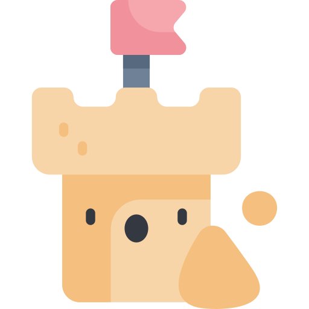

<!-- PROJECT LOGO -->
<br />
<p align="center">
  <a href="https://github.com/zalbani-lab/Front-Sandbox">
    
  </a>

  <h3 align="center">Front-Sandbox</h3>

  <p align="center">
    My sandbox to experiment with html, css and javascript
    <br />
    <a href="https://Front-Sandbox.zalbani.dev"><strong>View Online »</strong></a>
    <br />
  </p>
  <hr/>
</p>
<div align="center">

[![Forks][forks-shield]][forks-url]
[![Stargazers][stars-shield]][stars-url]
[![Issues][issues-shield]][issues-url]

</div>

## 🧐 About The Project <a name = "about"></a>

The goal of this directory is to centralize all my experiments using native web browser technologies (html, css and javascript).

### ⛏️ Built With

- [HTML](https://developer.mozilla.org/en/docs/Web/HTML) - HyperText Markup Language is the standard markup language for documents designed to be displayed in a web browser.
- [CSS](https://developer.mozilla.org/en/docs/Web/CSS) - Cascading Style Sheets is a style sheet language used for describing the presentation of a document written in a markup language.
- [Javascript](https://developer.mozilla.org/en/docs/Web/JavaScript) - JavaScript is a programming language that is one of the core technologies of the Web. JavaScript is used on the client side for webpage behavior.

## 🏁 Getting Started <a name = "getting_started"></a>

Follow these steps to get a local copy up and running.

### 🚀 Installation

1. Open `index.html` in your favorite browser
<!--

### 🎈 File structure

```sh
.
├─ assets
├─ sass
│   ├─ components
│   ├─ layout
│   ├─ pages
│   ├─ reset
│   ├─ utilities
│   └─ main.scss
└─ index.html
```

-->

## 🚧 Roadmap <a name = "roadmap"></a>

- [ ] Reorganization of the file structure
- [ ] Fancy home page
- [ ] Some crazy text animations
- [ ] Smooth scrolling

more to come ...

## 📝 License <a name = "license"></a>

Distributed under the MIT License. See `LICENSE` for more information.

## ✍️ Authors <a name = "authors"></a>

Alban Pierson – [https://github.com/Zalbani/](https://github.com/Zalbani)

<!--
## 🎉 Acknowledgements <a name = "acknowledgement"></a>

- Hat tip to anyone whose code was used
- Inspiration
- References
-->

[forks-shield]: https://img.shields.io/github/forks/zalbani-lab/Front-Sandbox?style=for-the-badge
[forks-url]: https://github.com/zalbani-lab/Front-Sandbox/network/members
[stars-shield]: https://img.shields.io/github/stars/zalbani-lab/Front-Sandbox?style=for-the-badge
[stars-url]: https://github.com/zalbani-lab/Front-Sandbox/stargazers
[issues-shield]: https://img.shields.io/github/issues/zalbani-lab/Front-Sandbox?style=for-the-badge
[issues-url]: https://github.com/zalbani-lab/Front-Sandbox/issues
